

  

<h1>🎯 PUBG 핵 유저 탐지</h1>

  <strong>Anomaly Detection</strong> 

 

## Overview

> - 온라인 게임에서는 핵/버그 사용자가 공정한 게임 플레이를 방해하고 사용자 경험을 저해하는 문제가 지속적으로 발생한다.
> - PUBG 역시 예외가 아니라, Krafton이 2024년 상반기에만 148만 계정을 영구 밴할 정도로 핵 사용이 심각한 문제다.
> - 그런데 실제 유저 로그 데이터에는 "핵 유저다"라는 정답 라벨이 존재하지 않아, 지도학습을 곧바로 적용할 수 없다.
> - Kaggle의 PUBG 유저 행동 로그 약 444만 건을 활용

| 항목 | 내용 |
|:-----|:-----|
| **📅 Date** | 2025.10 ~ 2025.11 |
| **👥 Type** | 개인 프로젝트 |
| **🎯 Goal** | 핵/버그 사용자를 효과적으로 탐지함으로써 공정성을 유지하고 사용자 경험을 향상 |
| **🔧 Tech Stack** | Python, Pandas, scikit-learn, PyTorch, Optuna, statsmodels(PSM/VIF) |
| **📊 Dataset** | [[Kaggle] PUBG Finish Placement Prediction](https://www.kaggle.com/competitions/pubg-finish-placement-prediction/data/) — 4,446,966 rows × 29 columns |

전체 분석 코드는 [`code/Anomaly_detection.ipynb`](code/Anomaly_detection.ipynb) 참고

---

## Insight

- **Create Label**: 서로 다른 원리의 두 모델이 동시에 이상치로 지목한 유저(**0.19%**)만 핵 유저로 정의
- **신뢰성**: PSM으로 유저 간 불균형과 혼란 변수를 제거한 뒤 U-Test를 적용, 3개 가설 모두 **p < 0.05**로 통계적 신뢰성을 확보
- **Supervised Learning**: 검증된 Label로 XGBoost를 학습하고 튜닝한 결과 **Recall 15%**, **F1 Score 5%** 향상
- **오탐(FP)**: 정상 유저 22만 5천여 명 중 오탐은 152건, **오탐율 0.067%** 불과해 실사용 관점에서도 부담이 적은 결과

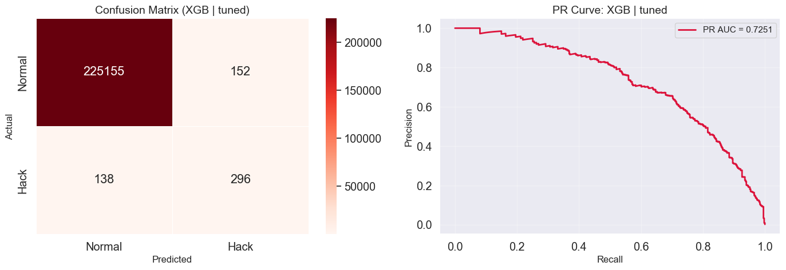

---

## Analysis

> 아래는 [`code/Anomaly_detection.ipynb`](code/Anomaly_detection.ipynb)의 분석 흐름을 요약한 것이다.  
> 전체 코드·중간 산출물은 노트북에서 확인할 수 있다.

### Data & Preprocessing

- [[Kaggle] PUBG Finish Placement Prediction](https://www.kaggle.com/competitions/pubg-finish-placement-prediction/data/)에서 4,446,966 rows × 29 columns 수집
- 이상탐지 목적과 무관한 순위·점수 기반 컬럼 8개
  - (matchId, numGroups, maxPlace, killPlace, matchDuration, vehicleDestroys, killPoints, winPoints) 제거
- `rankPoints`의 -1값(1,701,810건)은 결측이 아닌 "미참여"로 판단해 0으로 대체
- `total_distance`, `headshot_Rate`, `kills_per_distance` 등 파생 변수 생성

### EDA

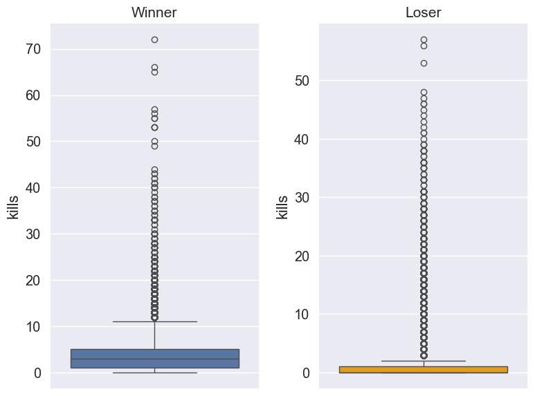
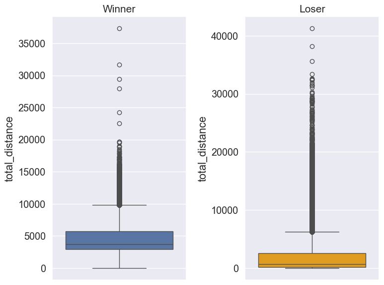

- 전체 변수 분포 확인 결과 0값이 대부분을 차지하는 비정규분포 형태 → 이후 스케일링은 **RobustScaler**를 선택
- 승리 유저 비율은 전체의 **2.87%** 에 불과하지만, 킬수 **4.3배**·이동거리 **2.6배**로 패배 유저보다 뚜렷하게 높은 수치를 보임
- **승리 유저 중 일부는 핵을 사용해서 승리를 도모했을 가능성이 높다고 가정**, 
- 이후 분석은 상위권 유저(`winPlacePerc` ≥ 0.74, 3분위수) 1,128,703명(25.38%)을 대상으로 진행

### Label Creation (Unsupervised Learning)

> 라벨이 없기 때문에 원리가 다른 두 비지도 모델을 각각 학습시키고, **공통으로 이상치라고 판단한 유저만 핵 유저로 정의**

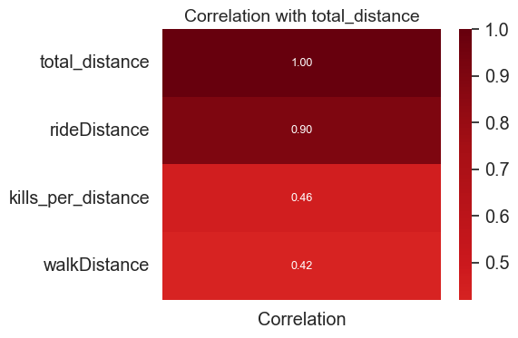
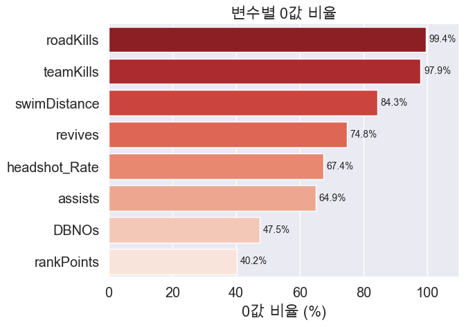

- 상관관계 확인 결과 `rideDistance`가 `total_distance`와 상관계수 **0.9**로 다중공선성 우려 → 모델 입력에서 제외
- `roadKills`(99.4%), `teamKills`(97.9%) 등 0값 비율이 극단적으로 높은 변수도 다수 확인됐으나 
- 희소 이벤트 자체가 이상행동 신호일 수 있다고 판단해 제거하지 않고 유지
- 실제로 이후 Feature Importance에서 두 변수 모두 상위권으로 확인됨(Results 참고)
- 이상치 비율은 Krafton 공식 발표 기반 핵 유저 감소 추세와, 상위권일수록 밀도가 높다는 가정을 반영해 **0.7%로 보수적 설정**
- ([PUBG Anti-Cheat 2024 1H Review](https://pubg.com/en/news/7584), [PUBG: BATTLEGROUNDS/문제점/핵 - 나무위키](https://namu.wiki/w/PUBG:%20BATTLEGROUNDS/%EB%AC%B8%EC%A0%9C%EC%A0%90/%ED%95%B5))

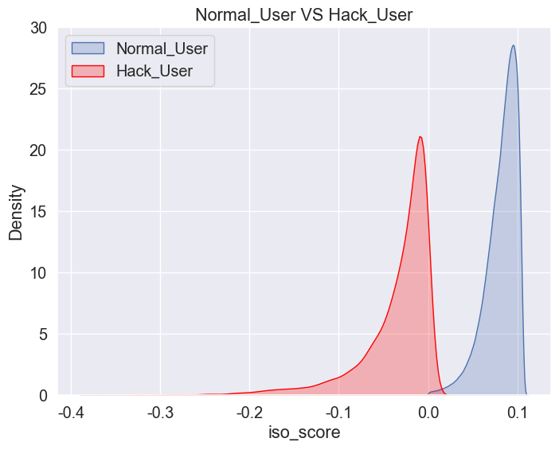
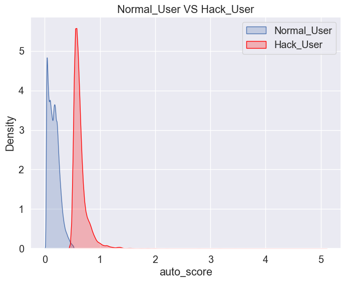

| 모델 | 이상치 개수 | 이상치 비율 |
|---|---:|---:|
| Isolation Forest | 7,901 | 0.7% |
| AutoEncoder | 7,901 | 0.7% |
| **공통 이상치(최종 라벨)** | **2,171** | **0.19%** |

- ISO Score는 음수 영역이 클수록, AutoEncoder는 재구성 오류(reconstruction error)가 클수록 이상치로 판단
- 아래는 AutoEncoder가 설정한 임계값(0.7% 지점)을 실제 재구성 오류 분포에 적용한 결과
- 두 모델 모두 이상치를 탐지했지만 완벽한 분리는 아님
- 실제 이상탐지의 목표는 완벽한 분리보다 효과적인 탐지에 있다는 점에서 합리적인 수준으로 판단

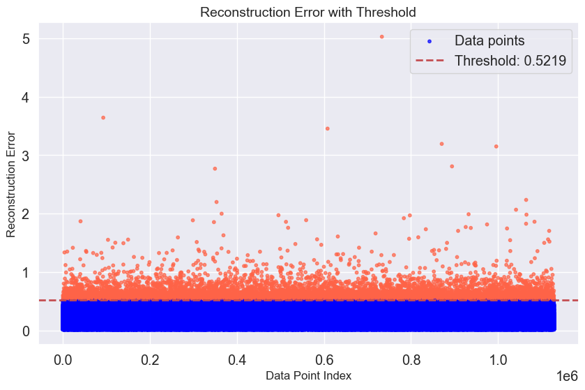

### Hypothesis

> EDA에서 확인한 승리/패배 유저 간 행동 차이를 바탕으로, 핵 사용 패턴에 대한 가설 3개를 세우고 통계적으로 검증

| 가설 | 내용 | 배경 |
|---|---|---|
| H1 | 핵 사용자는 일반 사용자보다 **헤드샷 비율**이 높을 것이다 | 정확한 에임 핵 사용 추정 |
| H2 | 핵 사용자는 일반 사용자와 다르게 **무기 획득 수**가 많을 것이다 | 스피드 핵 사용 추정 |
| H3 | 핵 사용자는 일반 사용자보다 **힐 아이템 사용**이 많을 것이다 | 스피드 핵·월핵 사용 추정 |

1. **VIF** 사전 점검(PSM이 로지스틱 회귀를 쓰기 때문에 다중공선성 확인)
2. **PSM**으로 정상/핵 유저 간 표본 불균형과 혼란 변수 제거
3. **U-Test**(비정규분포이므로 비모수 검정)로 그룹 간 차이 검정

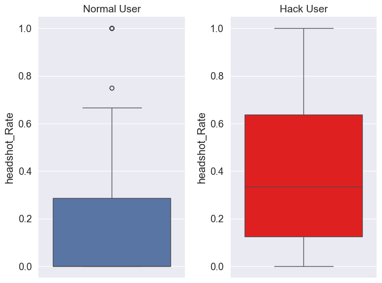
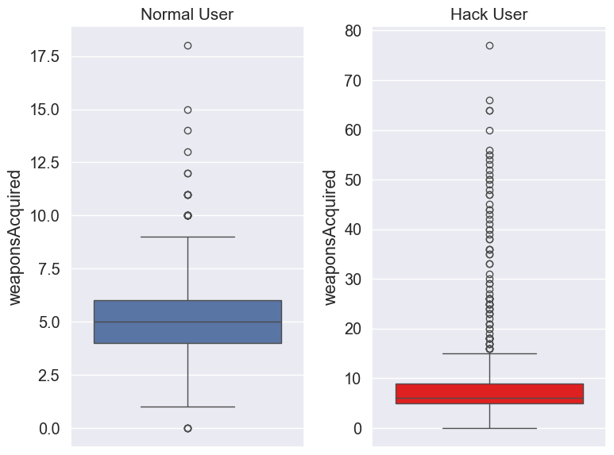
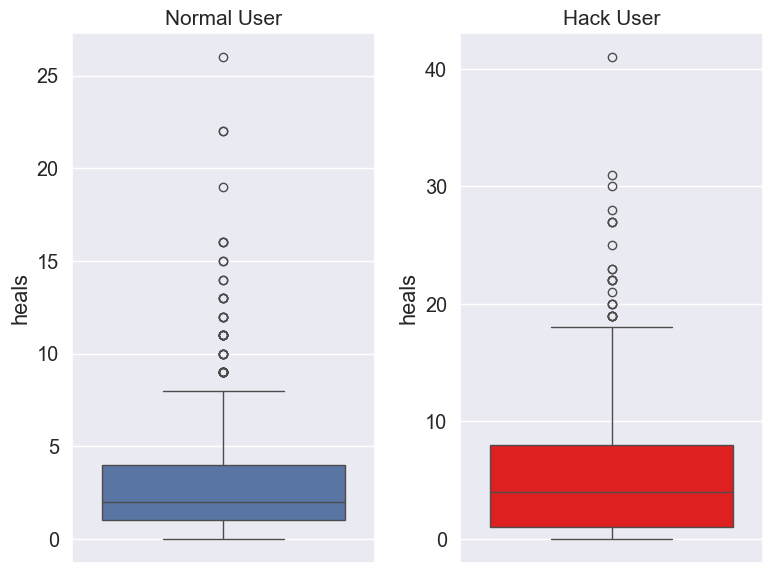

| 가설 | 검정 결과 | 판정 |
|---|---|:---:|
| H1 | 헤드샷 비율 p < 0.05 | 채택 |
| H2 | 무기 획득 수 p < 0.05 | 채택 |
| H3 | 힐 아이템 사용 p < 0.05 | 채택 |

> 3개 가설 모두 채택되면서, 비지도 학습으로 만든 라벨이 우연이 아니라 **실제 행동 패턴 차이에 근거한 라벨**  
> 임을 통계적으로 확인. 특히 PSM 단계는 "핵 유저와 정상 유저 표본 크기가 크게 달라 직접 비교가 무의미하다"는  
> 문제를 사전에 인지하고 보정한 과정으로, 라벨 검증 이전에 비교 자체의 공정성부터 확보했다는 점에서 의미가 있다.

### Model Selection

> XGBoost, LightGBM, CatBoost 3개 모델을 Base / Class Weight / SMOTE 3가지 방식으로 동일 조건 비교

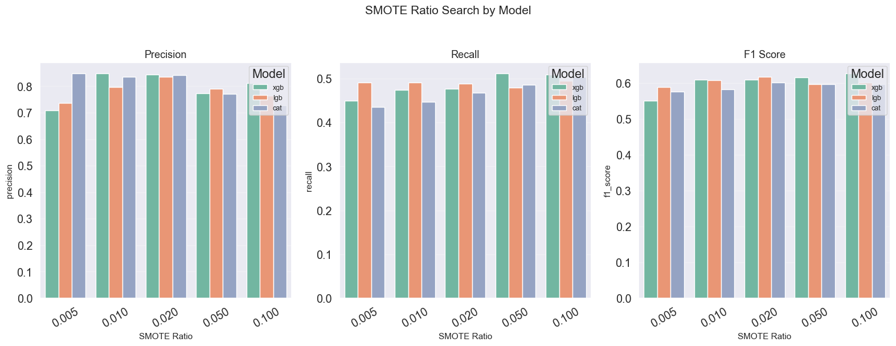

| Model | Method | Precision | Recall | F1 Score | PR AUC |
|-------|--------|-----------|--------|----------|--------|
| **XGB** | **Class Weight** | **0.69** | **0.59** | **0.64** | 0.70 |
| XGB | SMOTE | 0.78 | 0.53 | 0.63 | 0.70 |
| XGB | Base | 0.90 | 0.44 | 0.60 | 0.74 |
| LGB | Class Weight | 0.53 | 0.77 | 0.63 | 0.74 |
| CAT | Class Weight | 0.46 | 0.76 | 0.57 | 0.70 |

- Base는 Precision에 치우쳐 핵 유저 탐지에 한계(Recall 0.44), SMOTE는 Precision/Recall 균형이 애매함
- **XGBoost + Class Weight**가 F1(0.64)과 Precision/Recall 균형에서 가장 안정적이라 최종 방법으로 선택
- 이후 Optuna(TPE Sampler, 500회 탐색)로 `scale_pos_weight`를 포함한 하이퍼파라미터 최적화 진행

---

## Results

| Metric | Base | Class Weight | SMOTE | **Optuna Tuned** |
|--------|------|-------------|-------|-----------------|
| Precision | 0.9015 | 0.6946 | 0.7833 | 0.6607 |
| Recall | 0.4424 | 0.5922 | 0.5276 | **0.6820** |
| **F1 Score** | 0.5957 | 0.6393 | 0.6320 | **0.6700** |
| **PR AUC** | 0.7400 | 0.7000 | 0.7000 | 0.7251 |

> \* Base/Class Weight/SMOTE: Validation set 기준, Optuna Tuned: Test set 기준

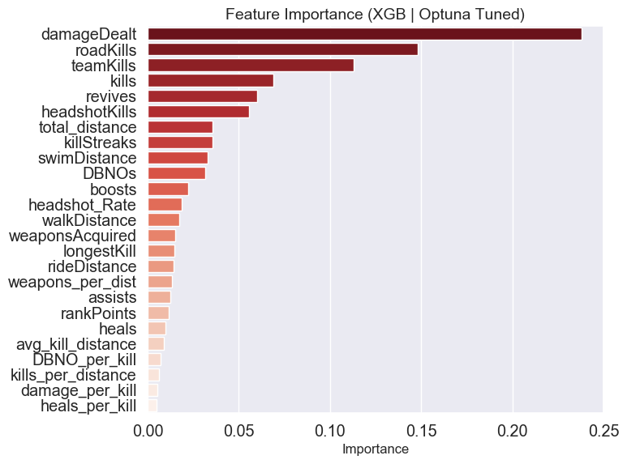

- Optuna 튜닝 이후 `damageDealt`가 가장 높은 중요도를 보였고
- 애초에 0값 비율이 99.4%로 극단적이라 제거를 고민했던 `roadKills`와 `teamKills`가 2·3위를 차지 
- "희소 이벤트가 이상행동 신호"라는 판단이 실제로 맞았음을 확인
- **Recall 개선**: Class Weight 대비 Optuna 튜닝으로 약 **15%** 향상
- **정상 유저 오탐율**: **0.067%**(FP 152건 / 정상 유저 225,307명)로 실사용 관점에서도 부담이 적은 수준

---

## Lesson and Learned

**Takeaways**
- 하이브리드 접근법: 비지도 학습으로 라벨을 생성하고 지도학습으로 성능을 향상시키는 파이프라인을 직접 설계한 경험
- 도메인 판단의 유효성: 
  - 0값 비율이 극단적으로 높은 변수를 제거하지 않고 "희소 이벤트 = 이상 신호"라는 도메인 맥락으로 유지 판단
  - 이후 Feature Importance 상위권으로 확인되며 자동화된 필터링보다 사람의 판단이 유효할 수 있음을 검증
- 클래스 불균형 비교: 
  - Base·SMOTE는 Precision 편향, Class Weight는 균형 잡힌 탐지 성능을 보임
  - 불균형 데이터에서 방법론 선택의 중요성 체감
- 통계적 검증의 필요성: PSM·U-Test를 통한 라벨 신뢰성 검증이 모델의 설득력을 높이는 데 핵심임을 학습
- 하이퍼파라미터 튜닝: Optuna 로 `scale_pos_weight`를 포함한 최적 파라미터를 탐색해 Recall 15% 개선

**Limitations**
- Ground Truth 부재: 비지도 학습 기반 라벨 특성상 노이즈가 불가피하며, 실제 핵 유저 패턴과 완전히 일치한다는 보장은 없음
- 미탐지(FN) 존재: 
  - 전체 핵 유저 중 약 32%는 여전히 미탐지 상태
  - threshold 조정이나 추가 행동 피처(에임 정확도, 반응속도 등)로 개선 여지가 있음
- 정적 데이터의 한계
  - 실시간으로 진화하는 핵 프로그램 패턴을 이 데이터(2019년 수집분)만으로는 반영할 수 없어
  - 주기적인 재학습 없이는 시간이 지날수록 탐지력이 떨어질 가능성이 있음

---

## Acknowledgements

이 프로젝트는 [Kaggle: PUBG Finish Placement Prediction](https://www.kaggle.com/competitions/pubg-finish-placement-prediction) 데이터를 사용